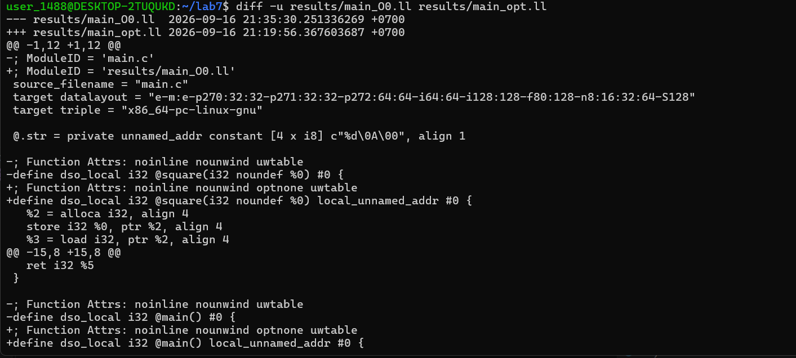
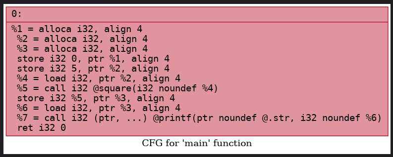

# Лабораторная работа №7
## Анализ и преобразование кода с использованием Clang и LLVM

**ФИО:** Семешко Анастасия Николаевна  
**Группа:** АП-326

## 1. Постановка задачи

Цель работы — познакомиться с инструментарием Clang и LLVM,
освоить получение абстрактного синтаксического дерева (AST),
промежуточного представления LLVM IR, применение оптимизаций
и построение графов потока управления.

В рамках работы необходимо:

- установить Clang, LLVM, opt и Graphviz;
- получить AST исходной программы;
- получить LLVM IR при `-O0`;
- получить LLVM IR при `-O2`;
- применить оптимизации с помощью `opt`;
- построить CFG;
- проанализировать влияние оптимизаций.

### Индивидуальное задание

Вариант: перечисления (`enum`).

Исходный код:

```c
enum Color { RED, GREEN, BLUE };

int main() {
    enum Color c = GREEN;
    int val = c + 10;
    return val;
}
```

## 2. Установка инструментов
Для выполнения лабораторной работы использовалась Ubuntu в среде WSL.

Были установлены следующие инструменты:

Clang — компилятор семейства LLVM;
LLVM — инфраструктура для анализа и оптимизации программ;
opt — инструмент для выполнения оптимизационных проходов LLVM;
Graphviz — инструмент для визуализации графов.

Установка выполнялась командами:
```c
sudo apt update
sudo apt install clang llvm opt graphviz
```


Рисунок 1 — Установка инструментов: Clang, LLVM/opt и Graphviz.


Рисунок 2 — Проверка установленных инструментов.

Исходный код:

# main.c
```c
#include <stdio.h>

int square(int x) {
    return x * x;
}

int main() {
    int a = 5;
    int b = square(a);

    printf("%d\n", b);

    return 0;
}
```
## 3. Работа с AST
AST был получен с помощью Clang:
```c
clang -Xclang -ast-dump -fsyntax-only main.c > results/main_ast.txt
```
AST содержит узлы, соответствующие функциям, переменным,
операциям и другим конструкциям исходной программы.

Результат:


Рисунок 3 — Фрагмент AST.

## 4. Генерация LLVM IR

### 4.1. IR без оптимизации

LLVM IR для исходной программы без оптимизации был получен командой:
```c
clang -S -emit-llvm -O0 main.c -o results/main_O0.ll
```
При -O0 код сохраняет большое количество промежуточных операций.
В частности, могут присутствовать инструкции alloca, load и store.

Результат:


Рисунок 4 — LLVM IR без оптимизаций (-O0).

### 4.2. IR с оптимизацией

LLVM IR с оптимизацией -O2:
```c
clang -S -emit-llvm -O2 main.c -o results/main_O2.ll
```
При -O2 LLVM выполняет оптимизации, поэтому количество
промежуточных операций может уменьшаться.

Результат:

Рисунок 5 — LLVM IR после оптимизации -O2.

## 5. Оптимизация IR c помощью opt

Для дополнительной оптимизации IR использовался инструмент opt.

Команда:
```c
opt -S -passes="default<O2>" results/main_O0.ll -o results/main_opt.ll
```
Сравнение с исходным IR:
```c
diff -u results/main_O0.ll results/main_opt.ll
```
После применения оптимизаций LLVM может удалить избыточные
операции и упростить вычисления.

Результат:

Рисунок 6 — Сравнение после оптимизации

## 6. Построение CFG

Для построения графа потока управления использовалась команда:
```c
opt -passes="dot-cfg" results/main_O0.ll -disable-output
```
В результате создаётся файл .main.dot.

Для преобразования DOT-файла в изображение использовался Graphviz:
```c
dot -Tpng .main.dot -o results/cfg_O0.png
```
Просмотреть изображение можно в проводнике Windows:

explorer.exe results

CFG при -O0:


Рисунок 7 — Построение CFG

Для построения CFG оптимизированной версии:
```c
opt -passes="dot-cfg" results/main_O2.ll -disable-output
```
После создания .main.dot:
```c
dot -Tpng .main.dot -o results/cfg_O2.png
```
CFG при -O2:


Рисунок 8 — Оптимизированная версия CFG

После оптимизации структура графа может стать проще,
если LLVM удаляет промежуточные операции или вычисляет значения
заранее.

## 7. Индивидуальное задание

Команда:
```c
clang -Xclang -ast-dump -fsyntax-only individual.c > results/individual_ast.txt
```
В AST перечисление представляется узлом EnumDecl, а его элементы —
узлами EnumConstantDecl.

Для данного перечисления:

RED   = 0
GREEN = 1
BLUE  = 2

Результат:


Рисунок 9 — AST c EnumDecimal и Green

IR при -O0

Команда:
```c
clang -S -emit-llvm -O0 -Xclang -disable-O0-optnone individual.c -o results/individual_O0.ll
```
В LLVM IR значение GREEN представляется как целочисленное
значение 1.

То есть:

GREEN → 1

Результат:


Рисунок 10 — individual_00.ll

13.2. IR при -O2

Команда:
```c
clang -S -emit-llvm -O2 individual.c -o results/individual_O2.ll
```
При оптимизации LLVM может выполнить свёртку констант:

GREEN = 1
1 + 10 = 11

Поэтому функция может быть сведена к возврату константы:

ret i32 11

Результат:


Рисунок 10 — individual_02.ll

## 8. Выводы

В ходе лабораторной работы были изучены основные возможности
Clang и LLVM.

Были выполнены следующие действия:

установлены Clang, LLVM, opt и Graphviz;
получен AST исходной программы;
сгенерирован LLVM IR при -O0;
сгенерирован LLVM IR при -O2;
выполнено сравнение неоптимизированного и оптимизированного IR;
применена оптимизация с помощью opt;
построены графы потока управления;
исследовано представление перечислений в AST и LLVM IR.

В индивидуальном задании установлено, что GREEN имеет значение 1
и при генерации LLVM IR представляется как целочисленное значение.
При -O2 LLVM может выполнить свёртку констант и получить результат
11 ещё на этапе компиляции.

## 9. Контрольные вопросы
1. Что такое Clang?

Clang — компилятор для языков C, C++ и Objective-C, построенный
на основе инфраструктуры LLVM. Он выполняет лексический,
синтаксический и семантический анализ исходного кода и может
генерировать LLVM IR.

2. Что такое LLVM IR?

LLVM IR (Intermediate Representation) — промежуточное
представление программы, используемое инфраструктурой LLVM.
Оно находится между исходным кодом и машинным кодом и используется
для анализа и оптимизации программы.

3. Что такое AST?

AST (Abstract Syntax Tree) — абстрактное синтаксическое дерево,
представляющее структуру исходной программы в виде набора
связанных синтаксических узлов.

4. Что такое SSA?

SSA (Static Single Assignment) — форма представления, в которой
каждое виртуальное значение определяется только один раз.
Использование SSA упрощает анализ зависимостей между операциями
и применение оптимизаций.

5. Чем отличаются -O0 и -O2?

-O0 используется для компиляции практически без оптимизаций,
поэтому получаемое промежуточное представление ближе к исходной
структуре программы.

-O2 включает набор оптимизаций, направленных на повышение
эффективности программы. В результате могут удаляться лишние
операции, сворачиваться константные выражения и упрощаться
структура программы.

6. Что такое CFG?

CFG (Control Flow Graph) — граф потока управления, вершины которого
соответствуют базовым блокам программы, а рёбра показывают
возможные переходы между ними.

7. Как перечисление представляется в LLVM IR?

В LLVM IR элементы перечисления представлены соответствующими
целочисленными значениями. Для данного примера:

RED = 0
GREEN = 1
BLUE = 2

Отдельной LLVM IR-инструкции для enum не требуется.

8. Является ли enum синтаксическим сахаром?

На уровне LLVM IR перечисление фактически сводится к целочисленным
значениям, поэтому его можно рассматривать как высокоуровневое
удобство для задания именованных констант. При этом на уровне
языка C enum имеет собственную семантику и не является буквально
просто заменой int.